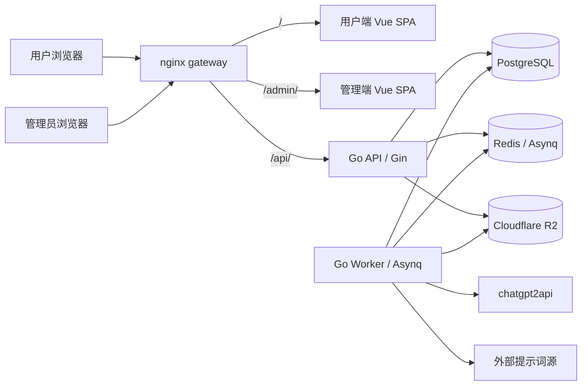
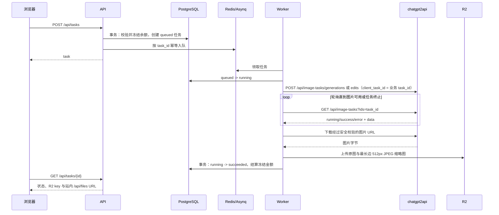

# 架构说明

本文描述当前仓库的运行时边界、核心数据流和部署约束。代码实现与配置示例优先于本文。

## 系统拓扑

Compose 中的 `server` 与 `worker` 来自同一个 Go 镜像，分别执行 `/app/server serve` 和 `/app/server worker`。`gateway` 是唯一对外端口，默认映射 `127.0.0.1:8080:80`。

## 组件边界

| 组件 | 技术 | 主要职责 |
| --- | --- | --- |
| `apps/web` | Vue 3、Vite、Pinia | 创作工作台、画廊、兑换码钱包与个人中心 |
| `apps/admin` | Vue 3、TypeScript、Element Plus | 用户、任务、社区、内容、安全与系统运营 |
| API | Go、Gin、pgx | 认证、校验、同步业务事务、R2 文件访问和队列投递 |
| Worker | Go、Asynq | 图片生成、缩略图处理、超时回收和提示词源同步 |
| PostgreSQL | 17（Compose） | 业务实体、钱包账本、运营配置和审计日志 |
| Redis | 7 | Asynq 队列和调度 |
| R2 | S3 API | 用户上传、任务产物和提示词封面 |

前端只访问同源 `/api`。用户端 Vite 开发服务器默认监听 `3102`，管理端监听 `3200`，两者都把 `/api` 代理到 `localhost:8000`。

## 请求与鉴权

1. 用户可通过 GitHub OAuth 登录，或使用 Gmail、Googlemail、QQ 邮箱完成验证码注册、邮箱密码登录和验证码重置密码；不提供 Google OAuth。OAuth identity、一次性 state 和带 `register|reset` 用途的验证码 HMAC 分表保存；成功后创建 `sessions` 与 HttpOnly Cookie `sc_session`，会话为 30 天滑动续期。
2. 管理员登录只使用邮箱和密码，查询独立的 `admin_accounts`、`admin_sessions`，并设置 HttpOnly Cookie `sc_admin_session`；会话为 12 小时滑动续期。管理员密钥及其接口已移除。
3. 两种 session token 都只以 SHA-256 hash 入库，用户与管理员密码分别使用 bcrypt 保存。管理员与用户允许使用同一邮箱，但身份、密码、状态和会话完全独立；任一种 Cookie 都不能通过另一侧鉴权。
4. `POST`、`PUT`、`PATCH`、`DELETE` 如果携带 `Origin`，必须命中 `ALLOWED_ORIGINS`。无 Origin 的非浏览器客户端允许访问。
5. Gin 只接受 `TRUSTED_PROXIES` 中代理写入的转发地址，防止伪造客户端 IP 影响限流与审计。
6. 管理端业务写请求及登录、改密写审计日志，记录状态码、目标、IP 和脱敏后的请求摘要；日志保留 6 个月。

## 图片任务生命周期

任务状态只允许 `queued -> running -> succeeded|failed`，或 `queued -> canceled`。Worker 进程重启和孤儿任务恢复允许 `running -> queued -> running`，该恢复不释放也不重复冻结金额。所有迁移使用带旧状态条件的 SQL UPDATE。失败和取消会释放冻结额；后台重入队失败任务时重新冻结同额费用。首次队列记录使用业务 task UUID；恢复时生成新的 Asynq 记录 ID，但 payload 与上游 `client_task_id` 始终使用原业务 UUID，既绕开已归档队列记录冲突，也保持上游幂等。

chatgpt2api 的文生图优先调用 `/api/image-tasks/generations`，带参考图的任务优先调用 `/api/image-tasks/edits`，再通过 `/api/image-tasks?ids=...` 轮询。业务 task UUID 同时作为 `client_task_id`，因此提交响应丢失、Worker 重试或进程重启接管都不会重复生成；轮询遇到临时网络错误、408/425/429/5xx 时继续等待，直到任务总超时。一旦已经拿到请求数量的图片就立即回收，即使上游最终状态稍后失败，也会保留已返回的图片。旧版上游仅在异步端点返回 404/405 时回退 `/v1/images/generations` 或 `/v1/images/edits`。客户端会规范化 base URL，避免 `/v1/v1` 和 `/v1/api`。类型差异由 `internal/prompt` 编译成 prompt 和参数；模型默认 `gpt-image-2`，可由 `app_settings.task_models` 按任务类型覆盖。上游 URL、Key、超时也可由后台设置覆盖环境变量，空值/0 时回落到 `C2A_*`；管理 API 对已保存 Key 只返回末四位掩码。

Worker 下载 chatgpt2api 返回的图片 URL 时限制单张 20 MiB，并再次校验响应大小和图片格式；认证头只发送给配置的 chatgpt2api 同源地址，跨域媒体地址不携带 Key，且所有地址和重定向都经过 SSRF 防护。原图原样写入 `output_keys`，同时生成缩略图写入 `thumbnail_keys`。列表只使用站内缩略图地址，需要预览或下载时才请求站内原图地址；`/api/files` 在鉴权后由 Server 代理读取 R2，避免用户网络无法直连对象存储时出现“任务成功但图片空白”。任务输入最多 4 张，校验归属、去重、单张与累计大小；远程输入和提示词源请求禁止私网、重定向到私网和 HTTPS 降级。

## 钱包与支付边界

- 所有金额以整数分存储；API 字段以 `Cents` 结尾。
- 每次余额变化必须和 `wallet_ledger` 写入处于同一事务。
- `(kind, source_type, source_id)` 的 partial unique index 防止任务、兑换码和人工调整重复入账。
- 当前所有环境仅注册只读套餐列表 `GET /api/plans`；不注册支付、订单创建、套餐购买、订阅查询、webhook 或后台补单接口。用户只能使用兑换码，管理员可做有审计记录的钱包调整。
- 历史订单、套餐、订阅表和内部结算代码暂时保留，以便既有数据库可无损升级，但不属于当前运行时入口。

## 社区与提示词

成功任务可以投稿到画廊。投稿支持分类、精选、排序、自动审核、每日限额和用户禁投；公开接口只返回已审核内容。提示词库包含手工条目与外部数据源条目，外部源支持 JSON、Markdown、HTML 三种解析格式。

Worker 每 30 分钟领取到期且启用自动同步的数据源。同步使用 `(source_id, source_item_key)` upsert，保留运营人员设置的启用状态、排序以及非 `other` 分类；六个内置数据源不可删除。

## 周期任务

| 周期 | 任务 |
| --- | --- |
| 每小时 | 删除过期 session |
| 每 10 分钟 | 回收运行超过 30 分钟的任务；兼容处理历史订阅 |
| 每 30 分钟 | 扫描并同步到期的提示词数据源 |

## 数据与迁移

数据库访问使用 pgx 和手写 SQL。Goose SQL 位于 `apps/server/migrations`，通过 `embed.FS` 编入二进制，`serve` 在监听端口前自动执行 `goose up`。Worker 依赖 Compose 中 `server` 健康后再启动，避免迁移竞争。

测试使用真实 PostgreSQL：测试工具创建临时数据库、执行迁移并在结束时删除。数据库的精确结构见 [DATABASE.md](DATABASE.md)。

## 部署与故障边界

- PostgreSQL 与 Redis 使用命名卷 `pg_data`、`redis_data`；`docker compose down` 保留卷，`down -v` 会删除。
- R2 与 chatgpt2api 是外部依赖，不由 Compose 创建。
- API 健康检查会验证数据库和 Redis；它不代表 R2 或图片上游一定可用。
- 网关把 `/api/` 的读取超时设置为 300 秒，并允许最大 20 MB 请求；应用上传限制为 15 MB。
- Compose 使用 `data`、`api`、`frontend` 三个内部网络；`edge` 只连接 Gateway 并负责宿主机端口发布；`outbound` 只提供给确实需要访问 C2A、R2、OAuth、SMTP 或外部提示词源的 Server/Worker。
- 线上与线下必须使用不同环境文件、数据库/Redis、R2 bucket、OAuth client、SMTP 凭据和 `APP_SECRET`。开发环境可以在 SMTP 缺失时回传调试验证码，生产环境禁止该行为。
- 生产环境必须在网关外提供 HTTPS；Compose 网关默认只绑定回环地址。生产模式强制使用强 `APP_SECRET`、HTTPS Origin 和 Redis 分布式限流。
