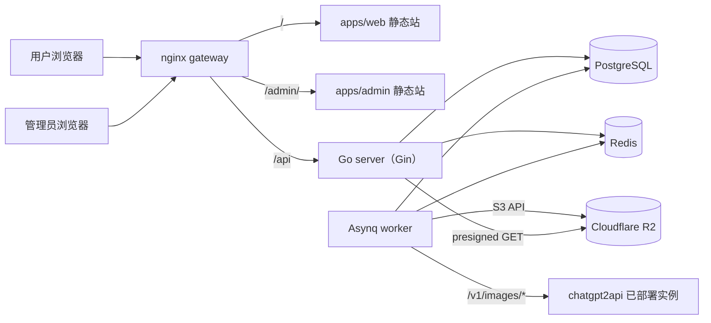

# 架构说明

## 总览



后端语言为 **Go**（单模块，单二进制多子命令：`server serve` / `server worker` / `server create-admin`）。HTTP 框架 Gin，数据库访问 pgx（手写 SQL），迁移 goose（embed 进二进制、`serve` 启动时自动执行），任务队列 [Asynq](https://github.com/hibiken/asynq)。

## 关键决策

1. **金额一律用整数「分」（cents）存储与计算**，字段后缀 `_cents`。禁止浮点参与账务。
2. **账本先行**：钱包余额的每次变化必须伴随一条 `wallet_ledger` 记录，且入账/扣费在**同一个数据库事务**内完成。幂等靠 `wallet_ledger` 上的唯一约束 `(kind, source_type, source_id)`，冲突时读取已有记录返回，不重复入账。
3. **任务状态机**：`queued → running → succeeded | failed | canceled`。提交时冻结费用（freeze），成功时结算（settle = 释放冻结 + 扣费），失败/取消时全额解冻（release）。所有状态迁移用 `UPDATE ... WHERE status = <旧状态>` 条件更新保证并发安全。
4. **任务执行**：Asynq（Redis 队列）。Worker `Concurrency = WORKER_CONCURRENCY`（默认 8），单用户同时运行任务数 `USER_MAX_RUNNING_TASKS`（默认 3，提交时校验）。对 chatgpt2api 的调用带超时与一次重试（仅网络类错误重试，生成类错误不重试；重试在业务层控制，Asynq 层 MaxRetry 设 0，避免双重重试导致重复扣费）。定时任务用 asynq 的 PeriodicTaskManager：每小时清理过期 session，每 10 分钟回收 running 超 30 分钟的僵尸任务。
5. **图片流转**：Worker 从 chatgpt2api 拿 `b64_json` → 直接上传 R2（`tasks/{user_id}/{task_id}/{n}.png`）→ 任务记录仅存 R2 key。前端通过 `GET /api/files/{key}` 获取短期 presigned URL 重定向。输入参考图由前端 `POST /api/uploads` 直传后端、后端写 R2。
6. **鉴权**：HttpOnly Cookie session（随机 token，服务端存 `sessions` 表 hash）。写请求校验 `Origin` 白名单（等效 CSRF 防护）。管理员即 `users.role = 'admin'`，后台与用户端共用登录接口，后台接口额外要求 role。
7. **错误模型**：业务错误返回 `apperr.E(code, message, httpStatus)`（实现 error 接口），统一中间件输出 `{"success": false, "code": "...", "error": "..."}`。非 apperr 才是 500。
8. **配置**：基础设施配置（数据库、Redis、R2、chatgpt2api 地址与 Key、密钥）走环境变量；运营配置（任务单价、每日免费额度、公告等）存 `app_settings` 表，后台可改。

## chatgpt2api 对接

- 文生图：`POST {C2A_BASE_URL}/v1/images/generations`，body `{model, prompt, n, size?, response_format: "b64_json"}`。
- 图生图/编辑（染色、模型图、以图生图等）：`POST {C2A_BASE_URL}/v1/images/edits`，JSON 形式 `{model, prompt, images: [{image_url|b64}], n}`。
- 鉴权：`Authorization: Bearer {C2A_API_KEY}`。
- 模型名默认 `gpt-image-2`，可被 `app_settings.task_models` 覆盖。
- 所有任务类型（t2i / coloring / ui_design / model_sheet / game_art / puzzle）最终都编译为「prompt + 可选参考图」调用上面两个接口；类型差异体现在 prompt 模板与默认参数，集中在 `internal/prompt` 包。

## 目录约定（apps/server，Go module）

```text
cmd/server/main.go       # 入口：serve / worker / create-admin 子命令
internal/
├── config/              # 环境变量加载
├── apperr/              # 业务错误类型 + 错误码
├── httpapi/             # Gin 路由与 handler（auth, me, tasks, uploads, files, plans, orders, gallery, meta, admin）
├── auth/                # session 签发/校验、Origin 校验中间件
├── store/               # pgx 连接池 + 各表数据访问（手写 SQL）
├── wallet/              # 冻结/结算/解冻/入账（账本幂等，事务）
├── taskflow/            # 任务提交/状态机/Asynq 入队
├── worker/              # Asynq handler：run_task + 定时任务
├── c2a/                 # chatgpt2api 客户端
├── storage/             # R2（S3 兼容）上传/删除/presign
├── prompt/              # 六类任务 prompt 模板
└── settings/            # app_settings 读写
migrations/              # goose SQL 迁移（embed）
```

## 部署

单机 Docker Compose；`gateway` 暴露 8080。生产上建议在外层再加一层 HTTPS（Caddy/宝塔/云负载均衡均可）。数据卷：`pg_data`、`redis_data`。R2 为外部服务不落盘。
