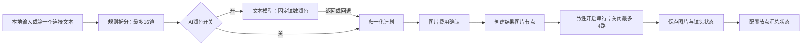
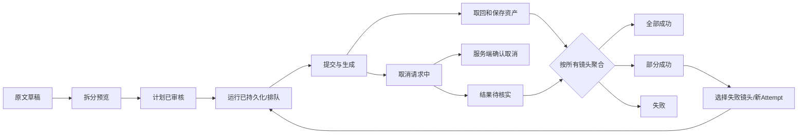

# 无限画布与分镜：现状审查、产品蓝图与实施方案

2026-09-22 文档核对说明：本文保留 2026-09-15 的审查依据、M0 进展、测试数量和后续蓝图。下文“当前”“尚未完成”均以原审查时点为边界，不能直接推断今天的线上状态。现码仍通过 `src/canvas/pages/canvas/project.tsx`、分镜相关组件/Hook 和工作流模块运行；已有输入签名、产物指纹与独立尝试身份等恢复保护，技能提及和模板入口也在继续演进。本次仅核对代码和文档，不更新历史测试成绩或宣称完整分镜工作台、收费模型及登录后视觉验收已完成。

日期：2026-09-15。审查对象：当前本地工作区，包含尚未提交的重构代码。

初版审查阶段不修改应用代码、不迁移数据库、不提交真实生成任务；随后按本方案启动了可回归的 M0 修复，仍未进行真实付费生成或破坏性数据操作。

> 实施进度（同日更新）：已开始 M0。当前已落地脚本超限提示与完整镜头源文本保留、连接脚本的本地覆盖语义、编辑器镜头边界保持、混合失败与重复进度修复、画幅误识别修复、复制/刷新运行态清理、独立镜头仍保留参考图、清空画布的 Agent 二次确认、文本输出的 `composerContent` 资源兼容、多文本/多图片的用户选择、图片角色提示、图片“全部镜头/指定镜头”范围、连接断开后的缓存清理，以及画布类型检查与分镜/可靠性回归修复。多输入现在不会静默全选：多个文本需要用户选择主剧本，图片需要用户启用、选择参考角色和镜头范围；模型上限和更完整的镜头级审阅仍需继续完善。另修复了“先建空分镜节点、后连接文本节点”时空 detached 状态屏蔽上游文本的问题。分镜工作台、稳定 Run/Attempt 模型、普通工作流统一入口和真实登录后视觉验收仍未完成。

## 1. 结论与推荐决策

当前无限画布已经具备较完整的基础设施：图像与文本节点、连接关系、局部编辑、工作流编译与检查点、任务幂等键、服务端任务查询、画布本地持久化与云端版本冲突合并、空间索引，以及 Agent 工具接入。不能将它概括成“没有恢复机制”或“所有功能都不稳定”。

主要问题集中在分镜的新旧实现衔接和领域模型：分镜目前更接近“脚本拆分后批量生成图片”，还不是完整的“可编辑、可审核、可版本化、可续跑、可交付的分镜工作台”。输入原文、镜头计划、运行状态和图片结果混在节点 metadata 中，不同入口、恢复逻辑和 UI 对同一状态的解释不一致。

推荐采用以下产品与技术方向：

1. **一个分镜项目、两个视图、同一份数据**：画布视图负责连接与空间编排；分镜工作台负责脚本、镜头顺序、逐镜编辑、批量操作和交付。
2. **一个主流程、两个启动方式**：默认“拆分预览 → 审阅 → 生成”，保留明确选择的一键模式；不要强迫用户手动连接“识别、润色、生成”三个技术节点。
3. **运行与内容分离**：原文、镜头计划、生成批次、镜头尝试、图片资产独立标识；节点只是这些内容的画布投影。
4. **所有入口使用同一执行器**：节点按钮、顶部工作流、Agent、重试、恢复都提交同一份分镜运行计划。
5. **先保护内容和状态，再优化界面**：优先解决截断、编辑回滚、错误成功、无法恢复、取消结果不确定及重复执行风险。
6. **当前交付定义为静态图像分镜**：视频与音频在代码中由功能开关关闭，不能将成片、配音、视频时间线描述为现成功能；将其列为后续扩展。

### 建议验收用的产品原则

- 用户写入的原文不能因查看预览、编辑另一镜头或模型失败而被静默改变。
- 用户必须知道本次用了什么文本、什么参考图、什么模型、生成多少镜头，以及哪些结果仍未完成。
- 生成失败不能抹掉原图，重试不能无说明地重新计费整批镜头。
- 刷新、关闭页面、断网、打开第二个标签页，都不能使执行事实与界面显示永久分叉。
- 接入下游的必须是明确的镜头与结果版本，而不是“当前碰巧显示的一张图”。

## 2. 审查范围、方法与边界

已阅读的核心区域：

- 画布页面编排：`pages/canvas/project.tsx`。
- 分镜面板、脚本编辑、模型参数、气泡层、图片节点的标题与说明显示。
- 分镜执行 Hook、规则解析、AI 返回归一化、布局、画幅识别、会话恢复。
- 普通生成、输入资源收集、节点复制、工作流编译与执行、待恢复任务。
- 本地/云端画布存储、导出、任务 API、工作流运行 API 与相关测试。

项目桌面策略：主验收视口 1440×900，最低 1280×720；关注浏览器缩放、键盘、溢出和焦点，不扩展手机适配。

证据等级：

- **A：已运行验证**，包括测试命令、纯函数或实际 Hook 的隔离执行。
- **B：代码路径确认**，可明确指出产生问题的分支，但没有调用真实模型验证端到端结果。
- **C：设计缺口或待验证风险**，不得宣称为已经发生的线上事故。

浏览器检查只覆盖未登录入口：`/canvas` 可以打开，新建画布触发登录提示。未绕过登录、未创建账号、未使用用户现有业务画布进行破坏性测试。因此本文对登录后布局的评价基于组件、样式和尺寸约束，**不等于已完成双视口截图验收或真实用户可用性测试**。

CodeGraph 返回了当前画布文件结构，但项目作用域中的 Storyboard 符号查询没有结果；涉及新增分镜模块的审查继续直接读取已知文件，没有自行重建索引。

## 3. 现有链路与能力盘点

### 3.1 当前分镜节点链路



文本润色还有单独的费用确认。当前并不存在所有路径都共享的“先人工审核计划”阶段。顶部工作流则通过普通 `handleGenerateNode` 运行，未复用该分镜链路。

### 3.2 已有能力，应保留与复用

| 区域 | 已有基础 | 本轮评价 |
|---|---|---|
| 画布 | 文本、图像、配置、分组、连接、撤销重做、资源引用 | 基础完整，应做跨功能一致性治理 |
| 布局性能 | 空间索引、可见区域裁剪、混合比例分镜布局 | 不建议推倒重做；需要真实交互基准 |
| 分镜解析 | 行、段落、显式标记、连续叙事四种模式 | 有测试，但输入保真与解释性不足 |
| 模型处理 | 固定镜数的 AI 润色、异常规则回退 | 能运行，但回退与部分修复不透明 |
| 结果生成 | 一镜一图片节点、排队、取消、重试、首个成功图作锚点 | 主流程存在，跨入口及跨批次不完整 |
| 任务恢复 | 部分已提交任务 ID 可持久化并重新查询 | 已提交任务与尚未提交的批次计划未完整统一 |
| 普通工作流 | 依赖编译、预检、执行租约、检查点、产物指纹 | 可作为分镜执行底座，但目前接入不一致 |
| 数据存储 | 本地备份、云端 revision 冲突合并、保存失败通知 | 已有重要保护，应增加常驻状态与领域级冲突处理 |
| 导出 | 画布 ZIP、节点资产导出 | 不是面向分镜交付的镜头清单与审阅包 |
| 视频/音频 | 类型与部分实现存在，但开关为 false | 本轮不以成片功能已可用为假设 |

## 4. 实际检查结果

| 检查 | 结果 | 含义 |
|---|---|---|
| `npm run typecheck:canvas` | 失败，5 条 TS 诊断 | 参数组件接口未对齐，当前不满足类型验收 |
| `npm run test:canvas-storyboard` | 23/23 通过 | 解析、布局、恢复等已有样例通过 |
| `npm run test:canvas-reliability` | 79 通过、2 失败 | 一处模块加载失败；一处权限预期不一致 |
| `npm run test:canvas-workflow` | 20 通过、1 失败 | 工作流测试文件未能加载，不是 20 个用例覆盖了完整工作流 |
| `npm run test:canvas-performance` | 7/7 通过 | 空间索引相关测试通过，不代表端到端 FPS 达标 |
| 额外隔离验证 | 见下表 | 无网络生成、无应用代码改动 |

额外验证结果：

| 输入或操作 | 实际结果 |
|---|---|
| 612 字符单镜文本，关键动作在末尾 | `sourceText` 520 字符，生成 `prompt` 240 字符，末尾动作丢失 |
| “下午16:30，女孩走进车站” | 检测为 9:16 |
| “They meet in the town square.” | 检测为 1:1 |
| “显示屏显示1920x1080，画面用竖屏” | 优先检测屏幕像素，得到16:9 |
| 标记模式的一场英文剧本，含标题和两行行动 | 解析为1镜，编辑面板却给3行；编辑后变成3镜 |
| 复制运行中的分镜配置 | `executionStatus` 被清除，但 `generationStage=generating` 被保留 |
| 恢复无任务ID的分析中分镜配置 | `executionStatus=canceled`，但 `generationStage=analyzing` 被保留 |
| 2镜中1成功、1失败，隔离运行真实 Hook | 主配置被写为 `succeeded/completed` |
| 2镜出现同一镜头两次取消通知，另1成功 | Hook 进度写为 `3/2` |
| AI只返回一个镜头、规则底稿为两个镜头 | 第二镜由规则补齐，但两个镜头都被标为 `confidence=high` |

注意：隔离 Hook 的外部分析/生图函数使用桩，不代表真实服务在所有时序下都已复现；它证明该 Hook 对这些事件序列的处理有确定性问题。

## 5. 问题清单与优先级

优先级定义：P0=上线前阻断项，重点是内容保全和可发布性；P1=主流程正确性/恢复性/计费可理解性；P2=交互效率、可访问性和交付完整度。严重性不是已发生线上事故的声明。

### F01｜脚本和镜头内容被静默截断【P0，A/B】

证据：`use-canvas-storyboard.ts:90`、`storyboard-parser.ts:85`、`storyboard-parser.ts:289`。

脚本多处 `.slice(0, 9000)`；单镜原文截到520字符，摘要截到240字符，规则模式的实际提示词来自这个摘要。超过16个片段会合并到最多16镜，界面没有给出原始镜数、合并映射或损失报告。

用户后果：否定条件、结尾反转、角色说明、商品约束等可能不参与生成，但用户认为完整剧本已被接受。编辑预览再回写还可能把截短内容写回输入字段。

方案：原文完整保存；解析输出保存原文范围；摘要只用于显示，不代替生成输入；超限明确阻断或分批，不能静默裁剪。显示“原文X字、识别N镜、本批M镜、未纳入K镜”。

验收：关键内容放在第241/521/9001字符后都不得静默丢失；17/30/100镜均给出明确处理方式。

### F02｜连接文本后，本地编辑会被上游内容覆盖【P0，B】

证据：`canvas-config-node-panel.tsx:512` 起的 effect 与 `commitScript`。

有连接文本时，effect 每次发现 metadata 不同便写回连接原文；文本框仍可编辑，本地修改先提交，再触发 effect 恢复。断开或清空输入时又没有清晰的来源切换契约；空 metadata 被 `if (!next) return` 忽略，存在旧草稿继续显示的风险。

方案：输入模式明确为“跟随来源”或“复制为独立脚本”。跟随时只读并提供“编辑源节点”；本地编辑前显式脱离链接或建立覆盖版本。上游更新只产生待应用差异，不覆盖已审核计划。

验收：输入、清空、撤销、断开重连、上游修改均可预测，用户编辑不闪回。

### F03｜编辑器显示的镜头边界与实际解析不一致【P1，A】

证据：`canvas-config-node-panel.tsx:1079`、`:1100`。

当解析只有1镜，但原文有多行时，编辑器回退到逐行显示；编辑任一行后又把全部行编号。在标记模式下，原本一场的标题与行动变成多个镜头。

方案：编辑器直接渲染同一份 `ShotDraft[]`，不要把展示行重新拼成带编号原文再解析。原文编辑与镜头编辑分开；改拆分模式先显示差异并要求应用。

验收：仅修改一个词不能无提示增加镜数或改变其他镜头边界。

### F04｜类型检查与关键测试通道失败【P0，A】

证据：`canvas-config-node-panel.tsx:871`、`:885`、`:887`、`:890`、`:987`。

- `AnchorPopoverTrigger` 不接受传入的 `title`。
- `AnchorPopoverPanel` 不接受传入的 `className`。
- `StudioReasoningSlider` 必需参数缺失及回调隐式 any。
- `canvas-storyboard-pipeline.ts` 使用 `@/lib` 运行时导入，被 Node 原生 TS 测试加载时无法解析，连带影响工作流和 Agent 可靠性测试。
- `test-canvas-feedback.mjs:74` 期待自动写入模式下清空画布仍需确认，当前权限函数并不这样处理。需要先决定产品权限契约，不能仅修改断言掩盖分歧。

方案：组件接口与真实调用对齐；纯领域模块避免依赖 UI、i18n 和无法解析的路径别名；测试统一加载策略；把分镜、类型与恢复测试纳入必跑检查。

验收：以上命令全部通过，失败模块实际执行其测试，而非被跳过。

### F05｜运行入口不一致，顶部工作流不走分镜专用链路【P1，B】

证据：`project.tsx:5463` 的工作流调用与 `:6986` 的分镜按钮分流；`handleGenerateNode` 位于 `:3717`。

节点按钮调用 `runStoryboardFromConfigNode`；普通工作流和普通生成接口调用 `handleGenerateNode`，后者没有分镜分派。相同配置节点可能被当作一次普通图片生成，镜数、润色、顺序和状态契约不一致。Agent 若走普通生成入口同样需要纳入验证。

方案：建立执行器注册表 `executeNode → storyboardExecutor/imageExecutor/...`。分镜执行器声明多结果输出、费用、取消、恢复和产物验证协议。未完成接入前，顶部运行应明确拒绝不支持的分镜节点，不能悄悄当普通节点运行。

验收：同一计划通过节点按钮、工作流、Agent执行，产生同样的镜头集合、参考资产和运行标识。

### F06｜重复生成覆盖批次宿主，旧结果失去完整会话入口【P1，B】

证据：`project.tsx:4377`、`:4490`；`canvas-storyboard-recovery.ts:147`；`project.tsx:1753`。

每次生成创建新的 storyboardId 并追加图片节点，但同一个配置节点的 storyboardId、planJson、outputIds 被替换。旧镜头保留旧ID，新流程又没有独立 Group 宿主。旧镜头寻找对应会话可能失败，再次打开分镜可能退化为新建空配置。

方案：Storyboard稳定ID；每次生成独立RunID；配置节点引用当前Storyboard，不承担唯一历史Run容器。提供“仅补失败、仅生成改动镜头、整批新版本”三种行为，历史永不覆盖。

验收：连续生成3次后，每次结果、模型参数、输入版本和锚点都能独立恢复；旧图仍能打开所属批次。

### F07｜复制和刷新可能留下假运行状态【P1，A/B】

证据：`canvas-node-copy.ts:29`；`canvas-generation-helpers.ts:380`；`canvas-config-node-panel.tsx:565`。

复制清除 executionStatus，却没有清除 generationStage；恢复中断任务时只对镜头节点修复部分阶段。分镜面板又用 `executionStatus OR generationStage OR isRunning` 判断运行，因此已取消/无任务的节点仍显示停止按钮并锁住编辑。

方案：运行状态来自唯一Run，不从多组遗留字符串做OR。复制只复制内容配置，绝不复制运行态；恢复先对账，再派生UI。升级时一次性归一化旧metadata。

验收：分析中、排队中、生成中、保存中复制/刷新均不出现无任务的“运行中”。

### F08｜整批状态与子镜头聚合矛盾【P1，A】

证据：`use-canvas-storyboard.ts:220`；`canvas-storyboard-recovery.ts:218`。

Hook在至少1成功时会把包含失败镜头的批次写为成功；聚合函数只要出现失败就判失败。多处写入可使状态随刷新/更新改变。成功+取消也被整体归入成功，无法准确传达“未完整交付”。

方案：引入 `partially_succeeded`；统一从本批镜头结果派生状态。显示“成功4/6、失败1、取消1”，不要只显示“已完成”。

验收：同一镜头集合在实时、刷新、重连和历史查看中的汇总完全一致。

### F09｜进度按事件计数，不按镜头状态计数【P1，A/B】

证据：`use-canvas-storyboard.ts:186`；`project.tsx:4758` 的取消通知和 `:4578` 附近worker跳过通知。

同一镜头的取消可以由操作入口与调度器各报告一次，计数直接累加；隔离执行得到3/2。乱序与重放同样没有按镜头/尝试去重的保障。

方案：以 `(runId, shotId, attemptId)` 保存最新状态；按服务端sequence/revision应用事件；处理进度是终态镜头数，成功率是成功镜头数，两者分开。

验收：任意事件重复、乱序、重放后进度都不超过总数，终态不回退到运行态。

### F10｜同批次单镜重试会中断当前批次控制器【P1，B】

证据：`project.tsx:6465`。

重试只阻止其他批次忙碌，却允许同批次继续，然后对共享 storyboardAbortRef 执行abort。在第一镜失败、后续仍运行时点击重试，可能终止剩余批次。

方案：每个Run一个调度器、每个Attempt一个控制器。重试加入当前批次的重试队列，不隐式取消其他镜头；或明确禁用并说明“本批完成后可重试”。

验收：重试第1镜不影响正在运行的第2镜；相同镜头并发重试最多创建一个新Attempt。

### F11｜AI分析任务没有完整持久化与恢复闭环【P1，B】

证据：`project.tsx:823` 起的分析任务回调，任务保存在Ref；恢复入口为 `pendingCanvasTasks`。

分析任务使用虚拟节点ID并保存在Ref中，缺少对应的耐久计划阶段记录。刷新后即使服务端仍在润色，页面难以把结果归回计划；未提交图片的队列只存在浏览器调度过程中。已有图片taskId恢复不能等价替代整批计划恢复。

方案：运行创建后即保存分析taskId、输入revision、阶段、待生成shotIds和参数快照。刷新先查运行，再接管或只观察；已提交任务查询结果，未提交任务明确续跑，不重新润色和重复收费。

验收：分析POST返回前后、图片排队中、首图完成后刷新，均有明确恢复路径；无法对账时标为“待确认”，禁止自动新建付费任务。

### F12｜分析取消路径吞掉取消失败【P1，B】

证据：`project.tsx:4833` 起的 `Promise.allSettled(...).then(...)`。

分析/格式化直接停止分支先本地结算为取消，再对服务端取消使用allSettled，随后清空取消队列，没有检查rejected结果；服务器请求失败时用户可能仍看到“已取消”。图片阶段存在另一套确认处理，不能混为同一路径。

方案：区分“已停止本地等待”“取消请求中”“服务端已取消”“取消失败待核实”；持久化待取消taskId，网络恢复继续查询。费用与退款依据服务端cancelPolicy和最终结算显示，不根据AbortError推断。

验收：注入取消接口超时/500后任务不失联，界面不宣称服务端已经停止。

### F13｜输入来源与参考图语义不完整【P1，B】

证据：`use-canvas-storyboard.ts:82`；`project.tsx:4427` 附近的sourceContext。

脚本只取第一个有文本的输入，没有多脚本排序/合并契约。参考图从文本sourceNode上下文获取，而不是统一从分镜配置输入快照获取；“本地脚本+只连接图片、没有文本source”时sourceContext为空，图片不参与生成。有文本source时，资源收集器可能通过其连接配置读取同级图片，不能一概说所有直连图片都被忽略。

关闭一致性会把sourceReferences清空，等于关闭参考图使用，而不仅是关闭跨镜头连续性。视频/音频未启用，不能用连线暗示能够解析其内容。

方案：输入区分主脚本、附加设定、角色参考、场景参考、风格参考、上一镜结果。执行前展示实际会使用的内容与顺序；参考图使用与连续性策略独立开关；超出模型限制给明确选择，不能无声取前4张。

验收：本地脚本+参考图、多文本、多角色图、断链、无权限资产、4张以上参考图均有可预测结果。

### F14｜画幅识别把时间和普通语义误当成设置【P1，A】

证据：`canvas-storyboard-aspect.ts:23`。

任意数字冒号被尝试转换比例，`portrait/landscape/square`被直接当画幅。像素描述优先于显式竖屏，提示词内容甚至AI润色文字能覆盖用户手选比例。

方案：画幅首先是结构化设置。仅在“自动”模式识别“画幅/比例/aspect ratio/尺寸”等明确上下文；时间、比赛比分、道具屏幕尺寸排除。优先级：单镜用户设置 > 整批用户设置 > 用户确认的文本识别 > 模型默认。冲突显示提示，不默默覆盖。

验收：时间、比分、地名square、人物portrait、屏幕像素、多个矛盾比例均有专项样例。

### F15｜模型参数显示、实际请求与重试快照不一致【P1，B】

证据：`canvas-config-node-panel.tsx:578`、`:688`；`project.tsx:4235`；初次镜头metadata `:4440`，重试配置`:6453`。

分镜文本参数把reasoningEffort写到节点，分析函数却以全局配置建立textConfig，只传入textModel覆盖。初次结果节点保存model/size等，但没有完整保存quality/resolution/background等本次配置；重试以结果节点+当前全局配置重建，可能漂移。

方案：所有生成都使用不可变 `ResolvedGenerationSpec`；UI预览、报价、请求、重试、历史读取同一快照。明确“原参数重试”和“按当前参数生成新版本”。

验收：改变全局设置后，原参数重试仍使用原模型、分辨率、质量、参考图与提示词；UI改动参数确实进入请求。

### F16｜AI返回不完整/畸形时修复过于隐式【P1，A/B】

证据：`storyboard-parser.ts:411`；`project.tsx:4280`。

缺镜以规则镜头补齐、超镜按位置截取、错误字段回退，归一化最终仍可能宣称整份来源为AI、每镜high confidence。AI润色失败只toast后继续图片生成；无法区分“模型确认过”和“规则兜底”。

方案：schema校验+逐镜diagnostics；按固定shotId匹配而不是只按数组位置；模型输出不允许改变授权镜头集合。部分修复保留来源标记与原响应摘要；默认回到审核，只有明确允许的自动模式才能继续。

验收：缺镜、多镜、错序、null、字符串代替数组、提示词空值、非JSON、超时、拒绝、内容过滤均有明确状态与用户选择。

### F17｜一致性实际能力与开关表达存在差距【P2，B/C】

证据：`project.tsx:4555` 的continuityAnchor，`:4670` 附近串行策略。

当前主要策略是首个成功镜头作为后续参考图，并串行生成。它不等价于锁定多角色身份、服装、道具、左右位置、场景轴线。首镜失败会让后镜成为锚点；首个成功图内容不理想也会向后传播。

方案：定义角色/场景设定表；选择锚点；支持先生成关键帧并确认，再生成其余镜头。默认首镜失败暂停依赖镜头，允许用户明确改锚点。连续性只作尽力保证，不承诺模型绝对一致。

验收：至少两角色、换装、跨场景、同场反打、无人物镜头、锚点重试/删除/失效有可解释处理。

### F18｜重新生成按钮缺少意图区分与结果审阅工作区【P2，B/C】

证据：`canvas-config-node-panel.tsx:741`；`project.tsx:1753`；`canvas-node.tsx:735`。

完成、失败、取消后主要动作均为重新生成；没有在主分镜面板中表达“只补失败/只重做改动/重做全批”。图片底部说明使用10px、两行截断、不可交互覆盖层；镜头结构字段没有对应完整编辑器。重新打开聚焦配置，不能等价替代镜头审阅。

方案：固定镜头导航、可编辑分镜表、图片对比、逐镜保留/重试、批量选择；图片不承载全部信息，说明放独立详情区。画布节点保留摘要而非塞满全套表单。

### F19｜分镜专属交付包缺失，通用导出有不完整成功风险【P1/P2，B】

证据：`canvas-export.ts:17`、`:31`、`:59`、`:102`。

项目文档下载失败时回退到旧project；资源读取返回null时不计入missingAssets；节点导出读不到媒体可能退化为JSON。对用户而言拿到ZIP不等于完整拿到图片。资源扫描只识别storageKey属性，分镜reference/anchor字符串、planJson内引用不构成完整依赖清单，需要做便携性测试。

方案：独立导出预检与manifest；资产缺失不得声称完整成功，可允许明确选择“带缺失清单导出”。提供按镜号排列的原图ZIP、镜头表、计划JSON、审阅图册；所有文件带内容版本和模型快照。图册/PDF为待实施能力，本轮不生成样稿。

验收：断网、资产404、权限变化、只在anchor中出现的资产、非本机导入均有确定行为。

### F20｜三阶段流水线残留与现行单配置模式不一致【P2，B/C】

证据：`canvas-storyboard-pipeline.ts:128`；`canvas-config-node-panel.tsx:171`。

流水线创建的节点同时拥有storyboardConfig和storyboardPipelineStep；UI优先判断前者，三种步骤会进入全自动分镜面板而非步骤面板。当前主要新建入口创建单配置，不应夸大为所有用户现在都会遇到三节点问题；但历史数据、模板或未来接入会遇到兼容风险。

方案：明确支持的一个主模型；旧pipeline只作为迁移输入或高级显示，不保留两个相互矛盾的执行系统。迁移前备份，不能仅删除旧模块。

### F21｜全局单例运行控制与跨标签并发缺少分镜域约束【P1，B/C】

证据：`use-canvas-storyboard.ts:78`；`project.tsx` 的单个storyboardAbortRef/latestId；普通工作流已有租约API。

当前同页通过单个Ref阻止多个分镜同时执行，未将每个分镜批次作为独立租约主体。现有普通工作流服务端租约并不自动覆盖直接分镜运行。第二标签重复点击同一分镜可能创建新的随机批次和请求键；尚未进行双标签实测。

方案：运行创建与幂等请求在服务端绑定projectId+storyboardId+inputRevision+operationId；同一次点击重试复用operationId，有意新版本使用新ID；并发上限由用户/模型统一管理。

### F22｜画布整体的可发现性、可读性与安全状态需统一【P2，B/C】

- 入口多：侧工具、右键、悬浮工具、配置面板；应由一份命令模型驱动，避免状态与命名不同。
- 常驻“本地已保存/云端同步中/离线待同步/冲突待处理”比只toast更适合长时创作。不能把已有保存保护说成不存在。
- 参数面板密集，脚本工具条4项横排；节点缩放后11px文字进一步变小。完整编辑应在不随画布缩放的固定工作台完成。
- 部分锁定使用pointer-events而非完整disabled/焦点状态，需键盘验证；多行镜头textarea缺少逐镜独立无障碍名称。
- 浮层需要统一Escape、关闭后焦点归还、边界避让、在画布缩放/平移时跟随或关闭。现有锚点实现监听window滚动/resize，画布transform路径需专测。
- 清空画布与Agent批量删除的确认策略存在测试分歧；将高影响操作单独定义，不能简单用“自动写入”覆盖所有操作。
- 历史布局测试通过不表示当前节点、Agent面板、右侧编辑器与顶部工具组合不会遮挡；应进行真实双视口验收。

## 6. 分镜产品蓝图

### 6.1 面向用户的任务，而不是技术步骤

目标用户及典型任务：

| 用户任务 | 默认流程 | 必须避免的成本 |
|---|---|---|
| 快速验证一个短故事 | 粘贴 → 看拆分 → 生成6镜左右 → 挑图 | 不理解节点类型也能开始 |
| 已有规范分镜脚本 | 导入文本 → 保持原镜号 → 只润色选中镜头 | 不被擅自合并、改写、改顺序 |
| 连续角色短片策划 | 角色设定 → 关键帧确认 → 剩余镜头 | 不让错误首图传染整批 |
| 商品广告提案 | 商品图+卖点约束 → 镜头计划 → 审阅包 | 不遗漏LOGO/颜色/结构要求 |
| 修改已有方案 | 改第3镜 → 标记待更新 → 只重做第3镜 | 不重复生成满意镜头 |
| 中途离开继续制作 | 自动保存 → 恢复运行事实 → 补未完成 | 不从头润色、不重复提交 |

### 6.2 两种创作方式

**标准模式（推荐默认）**：输入 → 本地拆分预览 → 可选AI润色 → 审核计划 → 生成 → 审阅与交付。

**一键模式（显式选择）**：输入 → 预检 → 显示本次镜数、规则、引用、费用估算 → 执行；默认不在模型异常、资产缺失、镜数变化时自行降级续跑。用户可单独授权“AI润色失败时使用规则计划继续”。

两个模式共享数据和执行器，只改变在哪一步需要人工确认。不恢复强制全屏模态向导，不要求始终暴露3个流水线节点。

### 6.3 一个分镜在画布上的呈现

- 创建一个“分镜”业务节点，显示标题、输入来源、镜数、版本、成功/失败概况和主动作。
- 执行产物可展开为一组图像镜头，默认有轻量容器/边界及镜序，而不是强制永久框住用户自由摆放。
- 拖动物理位置不改变逻辑镜序；调整镜序只能在明确的列表/排序操作里发生。
- 连线端口采用“脚本、参考资产、镜头集合”语义；下游可选第N镜、选定镜头或整组，禁止不透明地只拿第一图。
- 每镜连接绑定shotId和选定assetVersionId；上游重做后提示下游过期，默认不静默替换。
- 删除显示节点与删除分镜业务数据要区别处理，使用不同动作和说明；进行中结果不能因为画布节点被删就失去服务端归属。

## 7. UI布局与交互规格

### 7.1 双视图结构

顶部固定：项目名 / 分镜名、画布与分镜视图切换、保存状态、版本历史、导出。运行信息固定可见，但不挤占脚本编辑区。

分镜工作台由三部分组成：左侧镜头导航；中间计划表或审阅图；右侧选中镜头详情。Agent与右侧详情共用面板位，不并排再开一列。

```text
┌────────────────────────────────────────────────────────────────────┐
│ 项目 / 雨夜相逢   [画布 | 分镜]   已保存·云端同步完成  版本  导出    │
├────┬──────────────┬───────────────────────────────┬─────────────────┤
│工具│ 脚本与镜头    │ [计划表 | 图片审阅]             │ 第03镜 / 详情    │
│    │ 原文 / 设定   │ 原文修订v2 · 镜头计划v3         │ 原文来源         │
│    │              │                               │ 画面描述         │
│    │ 01 已保留     │ 镜号  画面/动作  景别  时长      │ 角色与参考图     │
│    │ 02 已保留     │ 01   ...                       │ 镜头语言         │
│    │ 03 失败       │ 02   ...                       │ 画幅/模型/参数   │
│    │ 04 待生成     │ 03   ...                       │ 当前版本 / 对比  │
│    │              │                               │ 只生成这一镜     │
├────┴──────────────┴───────────────────────────────┴─────────────────┤
│ 成功2/4 · 失败1 · 待生成1   [只补失败] [生成未完成] [停止排队]      │
└────────────────────────────────────────────────────────────────────┘
```

此图是待实施布局，不是现有页面截图。

### 7.2 尺寸预算

| 视口 | 工具轨 | 左侧镜头栏 | 右侧详情 | 中央可用宽度 |
|---|---:|---:|---:|---:|
| 1440×900 | 48 | 232 | 352 | 808 |
| 1280×720 | 48 | 208 | 328 | 696 |

以上为设计起点，不是实测保证；预留顶部56、底部36，其余内容区域独立滚动。左右栏允许折叠；1280宽时长脚本编辑可临时收起左栏。中央不要继续叠加悬浮配置框和Agent栏。主文字14px，辅助信息12px，关键字段不依赖10px文本。画布缩放<70%时节点以摘要呈现，双击在固定尺寸详情面板编辑，而不是要求用户读缩小表单。

### 7.3 输入工作区

- 大文本区支持粘贴、撤销、中文输入法；显示字符数和原文版本。
- 四种拆分方式使用用户语言：“每行一个镜头 / 按空行分段 / 按镜号标记 / 从叙事中拆分”，配短例子，不使用含糊的“格式化”。
- 模式切换实时更新预览，不立即改原文；提示将从N镜变为M镜，点击“应用拆分”才生成新计划版本。
- 原文与预览可左右比对；点击镜头高亮对应源文本范围；无法识别的部分在原文标记。
- 连接来源显示来源名称、版本、是否跟随；多脚本显示有序清单，明确拖动排序、合并或替换。
- 图片参考显示缩略图、角色/场景/风格用途与使用范围，不只给“已连接”徽标。

### 7.4 镜头编辑区

- 默认表列只保留：镜号、摘要/动作、人物、景别、时长、生成状态；镜头语言和详细参数在右栏渐进展开。
- 支持插入、删除、拆分、合并、拖动排序、多选、复制镜头、批量设置与键盘操作；所有内容操作可撤销。
- 镜号是显示顺序，shotId是稳定身份。重排不改变镜头身份，不把旧图片配给别的镜头。
- 锁定用户已确认字段；AI润色只修改允许字段，提供前后差异和逐条接受。
- 区分“原始描述、润色描述、实际生成提示词”；用户随时能查看最终请求内容。
- 已有图的镜头修改后显示“内容已更新，图片仍为v1”，保留图像，不伪装成新描述的已完成图。

### 7.5 图片审阅区

- 默认网格，支持单镜放大与两版本对比；说明文本不压在主体画面上，图内最多显示镜号/状态。
- 主动作：“保留此版”“生成新版本”“编辑这一镜”；失败显示可理解原因与建议，不直接暴露未清洗的底层错误。
- 快捷导航上一镜/下一镜；打开右侧详情不丢当前网格滚动位置；返回画布保留原视口和选中项。
- 多选时出现批量条；“仅失败”“仅待更新”“未生成”是状态过滤，不需要用户框选散落图片。
- 成功但未选定版本与已验收镜头分开标记；汇总反映交付完成度，而非仅后台任务完成度。

### 7.6 操作、反馈和无障碍

- 主按钮随阶段变化：拆分预览 → 确认计划 → 生成选中/未生成镜头 → 只补失败 → 导出。
- 点击提交后立即锁定同一次操作，显示真正的排队/生成/取回/保存阶段；不编造百分比和剩余秒数。
- 有耗时数据后才能给“约X–Y分钟”的估算；一致性串行策略要在提交前说明。
- “停止排队”不等于“取消已提交任务”；单镜、整批、全画布分别有明确范围。
- 右侧面板有标题、焦点入口与Escape退出；关闭后焦点回原触发按钮；菜单不越过支持视口。
- 所有表单使用真实disabled/readOnly语义，不只pointer-events；镜头输入框以“第N镜画面描述”命名。
- 状态同时使用文字和颜色；动画遵循reduced-motion；错误和保存状态可被辅助技术感知。

## 8. 输入、输出与异常契约

### 8.1 输入矩阵

| 类型/边界 | 必须行为 |
|---|---|
| 空白、仅空格、只有编号 | 阻止提交，指出有效内容要求 |
| 一行短创意 | 默认一镜；若要扩写成多镜，明确选择“扩写”，不伪装成解析 |
| 中英文剧本、INT/EXT、对白、舞台指示 | 保持原场景边界，非可视内容有归类/提示 |
| 长单镜、多段、9000字符以上 | 原文完整保存；提示限制并拆批，不静默截断 |
| 17/30/100镜 | 明确批次与总镜序；费用按将执行的镜头计算 |
| 多文本节点 | 显式选择主脚本与附加设定，顺序可见 |
| Markdown表格/JSON/表格文件 | 第一阶段仅支持明确定义的文本格式；后续导入需要映射向导和schema，不能自动猜列后提交 |
| 角色图、场景图、风格图 | 明确用途、引用范围、排序、模型支持与授权可读性 |
| blob/data URL、上传中、已删除资产 | 生成前转耐久assetId；上传未完成不提交；缺失不悄悄降级文生图 |
| 时间、比分、显示器尺寸、自然语言portrait | 不改变结构化画幅设置 |
| 脚本含HTML或模型指令 | 按数据处理和安全渲染，不作为工具授权；AI只返回受限计划，不允许执行任意操作 |
| 中文输入法组合输入、粘贴、撤销 | 组合输入期间不重新分裂当前控件，不移动焦点或改镜数 |

### 8.2 AI计划返回矩阵

| 返回问题 | 行为 |
|---|---|
| 完整且schema正确 | 保存计划版本，进入审核或已授权的自动阶段 |
| JSON包裹解释、代码围栏 | 提取后校验；保留诊断，不等同于完全可靠 |
| 缺镜、多镜、错序、重复shotId | 显示差异；按ID匹配；不能静默截取或宣称全AI高置信度 |
| 字段类型错误、空提示词、未知枚举 | 拒绝字段或标记回退，禁止不透明拼接 |
| 模型超时、429、余额不足、拒绝 | 区分可重试/需操作/终止，不全部变成规则继续 |
| AI内容与原文冲突 | 高亮对应原文，默认不覆盖用户锁定字段 |
| 响应到了但页面已关闭 | 结果归属durable run，返回后可恢复 |

### 8.3 图像结果矩阵

| 情况 | 必须行为 |
|---|---|
| 返回0张/多张 | 0张不能成功；多张按明确候选版本规则保存，不能无说明仅取第一张 |
| 原图成功但下载/存储失败 | 标为结果待保存，优先重试取回，不重新生成收费 |
| 图片比例/分辨率不符 | 记录实际尺寸与警告，不静默裁切；用户决定适应/裁切/重生成 |
| 单镜失败、其余成功 | 部分成功，保留结果；只补失败 |
| 响应迟到、旧Attempt完成 | 保存到旧Attempt，不覆盖新版本 |
| 运行时用户删节点 | Run继续有归属；结果进入分镜记录/待放回画布区，不丢失 |
| 返回可访问URL但资产已失效 | 区分任务成功与资产可用；提供重新取回路径 |
| 内容审核失败 | 说明不可继续原因；不自动反复尝试绕过规则 |

## 9. 状态模型与恢复设计

### 9.1 领域实体

| 实体 | 核心字段 | 职责 |
|---|---|---|
| StoryboardDocument | id, projectId, sourceRevision, planRevision, selectedRunId | 分镜业务身份，不随重生成变化 |
| ScriptSource | id, sourceNodeId?, mode, text, revision, contentHash | 完整原文与来源跟随规则 |
| Shot | id, order, sourceRanges, fields, lockedFields, selectedAssetVersionId, contentRevision | 可编辑镜头，顺序与身份分离 |
| StoryboardRun | id, documentId, planRevision, operationId, status, phase, lease, generationSpec | 一次明确授权的执行 |
| ShotAttempt | id, runId, shotId, attemptNo, taskId?, status, sequence, cost, resultAssetIds | 同一镜头每次尝试及服务端事实 |
| AssetVersion | id, storageKey, hash, dimensions, provenance, availability | 结果保全与可移植引用 |
| RunEvent | runId, shotId?, attemptId?, sequence, eventType | 断线重放与幂等状态更新 |

字段名是设计建议，不要求首轮全部建成独立数据库表；可以渐进落地，但ID、版本和状态责任必须先分开。

### 9.2 分离三种状态，避免新的组合爆炸

- 内容状态：`draft / reviewed / stale`，描述镜头计划是否已审核、是否落后于原文。
- 运行状态：`queued / running / paused / partially_succeeded / succeeded / failed / cancel_requested / canceled / reconciliation_required`。
- 阶段：`parsing / polishing / generating / fetching / saving`，只解释当前运行做什么，不能单独决定“是否运行中”。

ShotAttempt增加`submitting`阶段；submissionUnknown是需要对账的原因，不等于失败。资产可用性独立于任务状态，成功的任务也可能暂时缺原图。



### 9.3 必须维持的不变量

1. 原文与审核计划不因任务回调变更；回调只更新所属Run/Attempt/Asset。
2. 任务创建前有durable operationId；POST超时先查询原请求，不生成新随机幂等键盲重试。
3. 同一次服务端任务回调最多结算一次；旧sequence不得覆盖新sequence。
4. 未提交镜头仍是明确pending队列，不能刷新后全部伪装成“用户取消”。
5. 完成数≤总镜数；失败、取消、成功分别计数。
6. 只有全部预期镜头产物可用才是“全部完成”；删除节点不能缩小预期镜数而骗过聚合。
7. 取消中的任务保留taskId；服务端拒绝/超时不能清掉唯一对账线索。
8. 复制内容不复制taskId、lease、phase或执行身份；复制整份分镜生成新业务ID并重映射镜头ID。
9. 单镜重试使用原配置快照，除非用户选择修改参数生成新版本。
10. 撤销编辑不意味着撤销已提交的生成或扣费；界面必须明确分开。

### 9.4 刷新/断网恢复算法

1. 打开本地内容快照，显示“正在核对任务”，不要先宣称已取消或失败。
2. 按documentId查询当前Run与历史未结算Attempt。
3. 对有taskId的Attempt查询服务端；成功则取回保存资产，运行则继续观察，终态则同步状态。
4. 对提交结果未知的Attempt使用operationId查询，不先重新提交。
5. 对未提交镜头，依据原计划、执行策略、预算和租约恢复；默认在需要新增费用或输入过期时请用户确认。
6. 对取消请求未完成的Attempt继续对账；按服务端结果解释费用与退款。
7. 汇总状态由同一reducer派生，更新画布投影与工作台。
8. 另一个标签页持有租约时本页只观察；显式接管需等待租约规则，禁止两页同时续跑。

长期建议服务端调度分镜子任务，浏览器只编辑与观察。短期可以复用已有工作流租约与checkpoint，但不能把只持久化“当前节点”当作完整批次调度。

## 10. 技术拆分与集成方案

当前`project.tsx`超过7000行，包含生成、分镜、取消、恢复、工作流与界面编排；新Hook目前只抽出部分内容，运行所有权仍留在页面。这是回归放大的结构原因，但不建议一次性重写整个画布。

建议按依赖方向逐步拆分：

```text
纯领域层（无React/DOM）
  storyboard-schema / parser / validator / state-reducer / input-resolver
  generation-spec / revision-and-idempotency / export-manifest
          ↓
执行与存储适配层
  storyboard-executor / task-adapter / run-repository / asset-repository
          ↓
共享命令层
  preview / review / generate / retry / cancel / resume / export
          ↓
UI：画布节点、分镜工作台、工作流按钮、Agent工具
```

关键规则：

- 纯领域层使用可被Node直接加载的路径和类型，不导入页面常量、React组件、模型选择UI或翻译实例。
- React Hook订阅Run状态并发命令，不再通过多个Ref维护整个批次事实。
- 输入解析统一返回有来源、有版本的`ResolvedStoryboardInput`。
- `ResolvedGenerationSpec`由同一解析器构建，用于费用估算、实际请求和重试。
- NodeExecutor注册表声明输入类型、产物集合、计费范围、取消能力和恢复能力。
- 通用工作流校验必须理解分镜多镜头输出，不用普通count=1的规则验收整批。
- 云端同镜头的内容并发修改产生可见冲突，不能仅依赖节点级“最后写入”去猜作者意图。
- 记录结构化错误：输入、权限、余额、限流、上游、结果下载、资产存储、同步冲突、取消待确认；不同错误有不同动作。
- 遥测最小化：统计时长/状态/错误码，不默认记录用户完整剧本或敏感参考图；调试内容记录需有权限和保留期限。

### 10.1 历史数据迁移

- 识别legacy Group、现行单配置宿主、pipeline节点三类数据。
- 从planJson、镜头metadata、原文节点恢复能确认的信息；缺失字段标记unknown，不伪造为已审核或高置信度。
- 老结果保留asset，不因迁移重新生成。
- 被新批次覆盖宿主的旧storyboardId可从图片集合建立只读历史记录；缺失原计划时明确标记不完整。
- 迁移版本化、幂等执行；先本地/云端备份，再写新结构；保留回滚读取能力。
- 模板与复制是“新项目新运行”，不得携带旧taskId、租约、取消队列和执行时间。

## 11. 实施顺序与里程碑

以下为工作包与依赖，不是未经评估的人天承诺。每阶段都应有可独立验证的结果，避免最后一次性上线。

### M0：恢复发布基线与内容安全

范围：F01–F04、F07–F09、F14的确定性问题。

- 修复类型与测试加载；明确清空权限契约。
- 禁止静默截断，分离原文与预览。
- 修复连接编辑回滚、1镜多行编辑变多镜。
- 状态归一、复制清运行态、恢复清假阶段。
- 汇总与进度去重；画幅识别只接受明确意图。

完成条件：所有当前回归命令通过；本文额外验证变成长期回归；不需要真实模型即可验证。

### M1：统一执行、版本与恢复

范围：F05–F16、F21中的链路问题。

- 稳定StoryboardID、RunID、ShotID、AttemptID。
- 单执行器覆盖节点/工作流/Agent/重试。
- 保存完整输入与参数快照，分析taskId与未提交队列可恢复。
- 单镜重试不abort整批；取消失败不失联。
- run级租约、幂等、事件去重与旧结果隔离。
- 多批次历史与“只补失败”闭环。

完成条件：模拟API集成测试覆盖刷新、POST未知、取消失败、双标签、旧结果迟到；有授权测试账号后做小规模真实调用验收。

### M2：分镜工作台与高质量桌面体验

范围：第6–7节及F17–F18、F22。

- 固定工作台、输入来源、拆分预览、镜头表、右侧详情。
- 拆分/合并/排序/批量操作/版本对比/差异审核。
- 关键帧确认、角色与场景设定、可理解的连续性策略。
- 常驻保存与任务状态，键盘与浮层规范。

完成条件：1280×720、1440×900、浏览器125%缩放、长文本和16镜场景视觉验收；真实任务可用性走查通过。

### M3：交付、便携性与规模化

范围：F19–F20及长批次能力。

- 导出预检、原图ZIP、镜头表、计划JSON、审阅图册。
- 跨设备导入和依赖资产完整性验证。
- 长剧本分批、跨批次镜序与设定保持。
- 旧数据迁移与模板兼容；大型画布性能优化。

完成条件：断网/缺图导出行为准确，导入不依赖旧设备blob；500/2000节点的交互基准有记录。

### 暂不纳入主改造

- 完整视频剪辑、配音/口型同步、成片渲染。
- 手机与平板布局。
- 未定义冲突协议的多人实时协作。
- 为视觉焕新而替换全部画布渲染引擎。

## 12. 测试与验收矩阵

### 12.1 层级

1. 纯函数：解析保真、schema、画幅、状态归并、ID重映射、导出依赖收集。
2. Hook/执行器：使用确定性事件与假任务服务，覆盖提交、进度、错误、取消及重试。
3. 持久化集成：真实本地存储适配+假云端revision/lease；测试刷新和冲突，不只检查源码字符串。
4. 桌面E2E：登录fixture、模拟模型与任务接口；所有按钮走真实UI；不调用付费上游。
5. 授权后的真实上游验证：少量代表样例确认供应商能力、计费、取消和资源取回；预算事先确认。

### 12.2 核心场景

| 类别 | 必测组合 | 通过标准 |
|---|---|---|
| 输入 | 空白/一镜/多行一场/四种模式/长镜头/30镜/中英文 | 不丢原文；预览镜数=计划镜数 |
| 编辑 | 连线后编辑/清空/断链/模式切换/IME/撤销/重排 | 不闪回、不串镜、稳定焦点 |
| 参数 | 文本推理强度/模型切换/画幅冲突/质量/分辨率 | 所见参数=报价参数=请求参数 |
| 引用 | 本地脚本+图/多文本/多角色/缺图/权限失效 | 实际引用可见；不无声降级 |
| 模型输出 | 畸形JSON/缺镜/错序/多图/0图/内容拒绝 | 结构错误可解释，不能伪成功 |
| 批次 | 全成/全败/混合/成功+取消/1失败后单镜重试 | 聚合稳定；仅目标镜头重试 |
| 事件 | 重复/乱序/旧Attempt/晚到taskId | 无进度溢出、无错误覆盖 |
| 中断 | 提交前/POST超时/分析中/图片运行/结果保存 | 不重复收费，可恢复或明确待核实 |
| 取消 | 排队镜头/运行镜头/全批/取消超时/已完成竞态 | UI与服务端事实一致，退款不猜测 |
| 历史 | 连续3次生成/旧镜头打开/修改后重试 | 批次归属稳定，版本可比较 |
| 复制删除 | 复制运行节点/整批复制/删宿主/删运行镜头/撤销 | 不继承执行权、不丢服务端结果 |
| 多窗口 | 双标签同时启动/租约失效/一个只观察 | 只有一个合法执行者 |
| 下游 | 选定镜头接图像任务/整组输出/上游改版 | 明确集合语义与过期提示 |
| 导出 | 缺图/文档未加载/引用只在锚点/跨设备导入 | 完整性明确、顺序稳定、内容可复用 |
| 布局 | 双视口/125%/长模型名/16镜/Agent开关/低缩放 | 操作不遮挡，关键文字可读 |
| 键盘 | Tab/Shift-Tab/Escape/菜单/锁定中参数 | 焦点正确，禁用不可绕过 |

### 12.3 性能与体验目标（待建立基线）

- 测试数据：100/500/2000节点，16/64镜，混合画幅；10k节点作为空间索引压力，不直接承诺完整UI支持10k。
- 记录拖动/缩放帧时长p50/p95、长任务、输入响应、内存、项目恢复时间、云端保存队列长度。
- 目标建议：本地编辑反馈≤100ms；任务提交后立即显示已受理/排队状态；不因流式任务更新重渲染全部可编辑镜头。
- 导出大资产限制并发，显示真实已打包数，可取消，避免全量Promise.all与内存集中占用。
- “60fps”“零丢失”“绝对一致性”不能在未实测前写为已达成。

### 12.4 用户可用性验收

邀请代表性用户完成：粘贴剧本生成；替换一个参考人物；修改第3镜而保留其他图；从失败中恢复；刷新后续作；导出交给他人。

观察任务成功率、错误启动次数、误重生成次数、找不到结果次数、需要解释的术语；先记录现状基线，再验证改版是否改进。可将“首次使用5分钟内理解并完成拆分与首次提交、恢复无需人工改节点metadata”作为试验目标，而不是预先宣称用户体验已经极好。

## 13. 建议先确认的产品决定

这份方案可以作为实施起点，不必等所有问题都回答才修复确定性缺陷。进入M1/M2前建议确认：

1. 默认采用可审核流程，并保留显式一键模式。
2. 关闭一致性不再等于不用参考图。
3. 标准批次先保留16镜上限，但超限改为明确分批/阻断，不自动合并。
4. 重生成默认新版本，不覆盖历史；主按钮优先“只补失败/未生成”。
5. 当前只承诺静态图像分镜交付，视频链路另开里程碑。
6. Agent清空画布、批量删除与恢复快照采用单独的高影响操作策略。

## 14. 关键源码导航

所有行号对应本次工作区，后续重构可能变化。

- [分镜执行Hook](../apps/web-react/src/canvas/pages/canvas/hooks/use-canvas-storyboard.ts)
- [分镜脚本输入与同步](../apps/web-react/src/canvas/components/canvas/canvas-config-node-panel.tsx)
- [分镜文本参数](../apps/web-react/src/canvas/components/canvas/canvas-config-node-panel.tsx)
- [分镜编辑器拆分回写](../apps/web-react/src/canvas/components/canvas/canvas-config-node-panel.tsx)
- [规则解析与截断](../apps/web-react/src/canvas/lib/canvas/storyboard-parser.ts)
- [AI计划归一化](../apps/web-react/src/canvas/lib/canvas/storyboard-parser.ts)
- [画幅识别](../apps/web-react/src/canvas/lib/canvas/canvas-storyboard-aspect.ts)
- [分镜分析与生图](../apps/web-react/src/canvas/pages/canvas/project.tsx)
- [分镜批次宿主更新](../apps/web-react/src/canvas/pages/canvas/project.tsx)
- [取消链路](../apps/web-react/src/canvas/pages/canvas/project.tsx)
- [普通工作流执行入口](../apps/web-react/src/canvas/pages/canvas/project.tsx)
- [单镜重试](../apps/web-react/src/canvas/pages/canvas/project.tsx)
- [节点按钮专用分派](../apps/web-react/src/canvas/pages/canvas/project.tsx)
- [会话恢复与聚合](../apps/web-react/src/canvas/lib/canvas/canvas-storyboard-recovery.ts)
- [复制metadata](../apps/web-react/src/canvas/lib/canvas/canvas-node-copy.ts)
- [中断恢复](../apps/web-react/src/canvas/lib/canvas/canvas-generation-helpers.ts)
- [待恢复任务收集](../apps/web-react/src/canvas/lib/canvas/canvas-pending-tasks.ts)
- [云端保存与冲突合并](../apps/web-react/src/canvas/stores/canvas/use-canvas-store.ts)
- [通用导出](../apps/web-react/src/canvas/lib/canvas/canvas-export.ts)
- 历史 pipeline：`apps/web-react/src/canvas/lib/canvas/canvas-storyboard-pipeline.ts`（原审计文件，当前已移除；仅保留名称作为历史证据）
- [任务与取消API](../apps/web-react/src/canvas/services/canvas-task-api.ts)
- [工作流运行API](../apps/web-react/src/canvas/services/canvas-workflow-run-api.ts)
- [桌面支持策略](DESKTOP_UI_POLICY.md)
